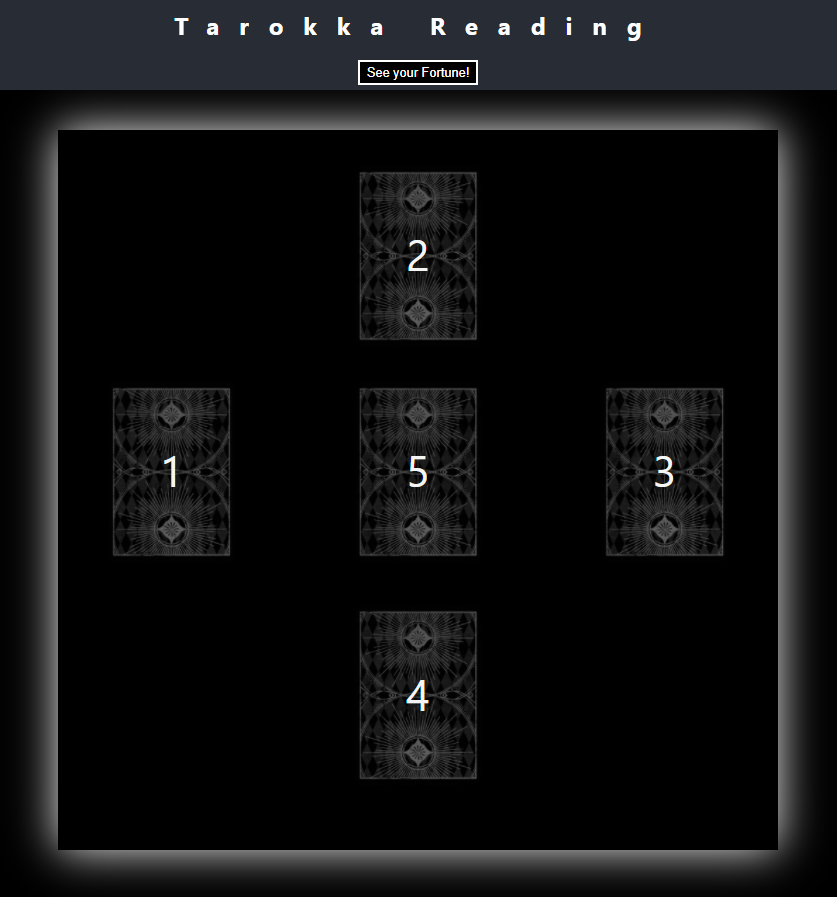

# TAROKKA DECK 
## Description
A digital Tarokka deck! A fictional variation on the Tarot Deck, the Tarokka deck is used in Dungeons & Dragons to tell the future. With this deck, you can quickly and easily enact a fortune-telling for yourself or at the D&D table.

[Link to live page](https://rookieprime.github.io/tarokka-deck/)

## Table of Contents

- [Questions](#Questions)
- [Code-of-Conduct](#Code-of-Conduct)
- [License](#License)

## Questions
If you need to reach me, my GitHub username (and a link to my profile page) is [RookiePrime](https://github.com/RookiePrime) and my email address is [kiefer.levine@protonmail.com](mailto:kiefer.levine@protonmail.com).

### Frequently Asked Questions
#### How did you make this?
This single-page application was made using React.js. It's a purely front-end project.

## Code-of-Conduct
### Contributor Covenant
We as members, contributors, and leaders pledge to make participation in our
community a harassment-free experience for everyone, regardless of age, body
size, visible or invisible disability, ethnicity, sex characteristics, gender
identity and expression, level of experience, education, socio-economic status,
nationality, personal appearance, race, caste, color, religion, or sexual identity
and orientation.

We pledge to act and interact in ways that contribute to an open, welcoming,
diverse, inclusive, and healthy community.
[Click here to read the full code of conduct](https://www.contributor-covenant.org/version/2/0/code_of_conduct/)

## License
This software is offered under the MIT License. For more information on conditions of use, [follow this link.](https://opensource.org/licenses/MIT).
